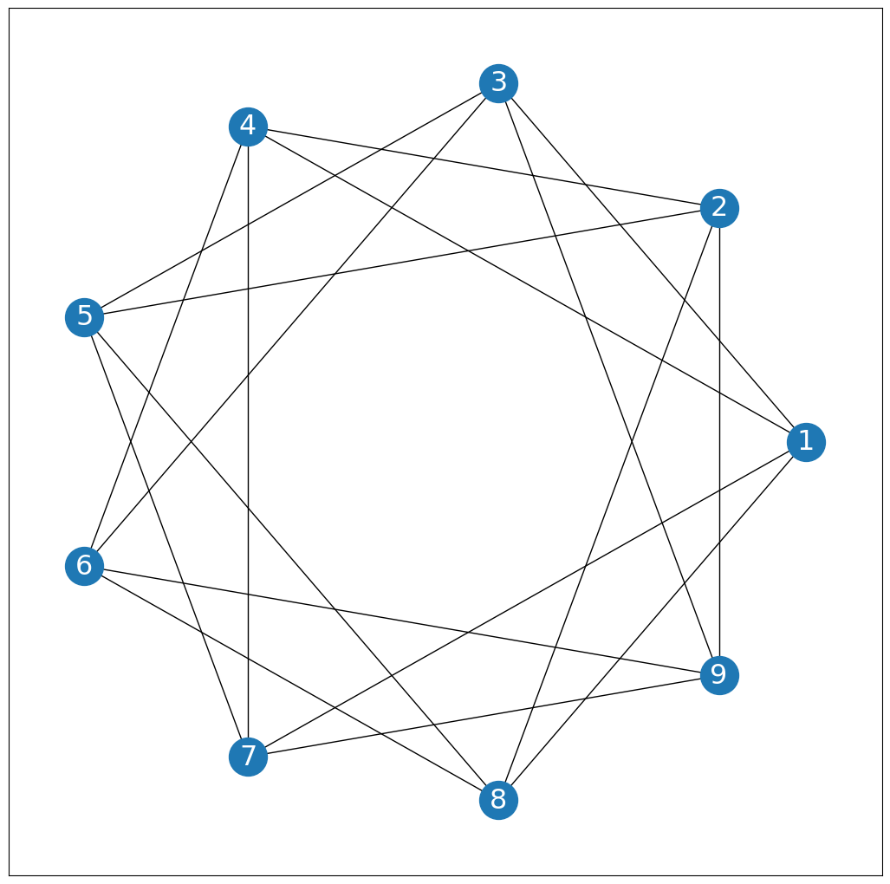
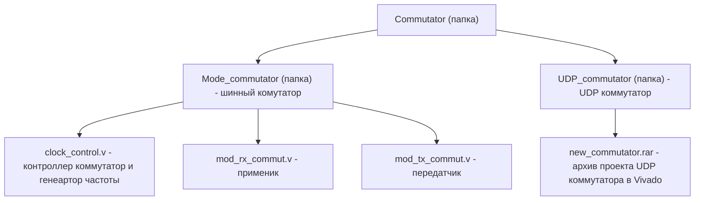

# A software package for prototyping systems on a large-size chip using multiple FPGA chips 
**Description:** A hardware and software package that automates the generation of firmware for FPGAs, and connects both FPGAs with a high–speed interface.
Tasks:
1) Development of a software package for dividing a network on a chip across several FPGAs;
2) Implementation of interaction between FPGAs via the Ethernet interface;
3) Implementation and prototyping of a network on a chip and the implementation of a complex system on a chip on two FPGAs interconnected by a parallel bus;

In this work, we used a network on a chip developed by the MIEM CAD Department. This network consists of N nodes (for example, there are 9 in the figure), each of which is a router and a schoolMIPS processor. This topology is called a circulant topology.


Firmware generation software (parser) for two FPGAs makes it easier for a developer of on-chip networks and processors to prototype promising architectures on multiple FPGAs. The parser is parameterized, which makes it easy to split the network into two FPGAs: you need to specify which routers will be implemented in the selected FPGA. The synthesis of the connection list is based on the open source Yosys tool (https://github.com/YosysHQ/yosys ), which makes it easier to transfer the project to FPGAs from different manufacturers (Xilinx FPGAs were used in the project).

The performance of a multi-FPGA system depends on the bandwidth of the communication lines of the FPGA crystals. The use of GPIO is not justified by the speed, as well as the insufficient number of FPGA pins for large on-chip (SnC) systems. The solution to these problems may be to use ultra-high-speed interfaces (for example, Ethernet). Ethernet communication is implemented thanks to a UDP switch.

### Structure (main code):

- ***The Parser***

```mermaid
graph TD;
  A["Parser (folder)"]-->C["parser.py - generation of files at the top level of the hierarchy for two FPGAs"]
  A["Parser (folder)"]-->B["auto_scripts(folder)"]
  B["auto_scripts (folder)"]-->D["synth_noc_fpga_1.ys - synthesis of the connection list"]
B["auto_scripts (folder)"]-->E["test_edif_script.tcl - implementation and generation of firmware for FPGAs"]
``
- ***Switch***
```mermaid
graph TD;
  A["Commutator (folder)"]-->B["Mode_commutator (folder) - bus commuter"];
  A["Commutator (folder)"]-->C["UDP_commutator (folder) - UDP switch"];
  B["Mode_commutator (folder) - bus commuter"]-->D["clock_control.v - controller switch and frequency generator"];
  B["Mode_commutator (folder) - bus commuter"]-->F["mod_rx_commut.v - application"];
  B["Mode_commutator (folder) - bus commuter"]-->G["mod_tx_commut.v - transmitter"];
  C["UDP_commutator (folder) - UDP switch"]-->E["new_commutator.rar - archive of the UDP switch project in Vivado"];
``

---

# Программный комплекс для прототипирования систем на кристалле большого размера с использованием нескольких чипов ПЛИС 

**Описание:** Программно – аппаратный комплекс, автоматизирующий генерацию прошивок для ПЛИС, и соединяющий обе ПЛИС высокоскоростным интерфейсом.
Задачи:
1)	Разработка программного комплекса для разделения cети на кристалле по нескольким ПЛИС;
2)	Реализация взаимодействия между ПЛИС посредством интерфейса Ethernet;
3)	Имплементация и прототипирование сети на кристалле и реализацию сложной системы на кристалле на двух ПЛИС, соединенных между собой параллельной шиной;

В данной работе использовалась сеть на кристалле, разработанная УЛ САПР МИЭМ. Данная сеть состоит из N узлов (для примера на рисунке их 9), каждый из которых представляет собой роутер и процессор SchoolMIPS. Данная топология называется циркулянтной.



Программное обеспечение для генерации прошивок (парсер) для двух ПЛИС позволяет упростить разработчику сетей на кристалле и процессоров прототипирование перспективных архитектур на нескольких ПЛИС. Парсер параметризирован, что позволяет с легкостью разъеденить сеть на две ПЛИС: необходимо указать какие роутеры будут имплементированы  в выбранной ПЛИС. Синтез списка соединений основан на открытом инструменте Yosys (https://github.com/YosysHQ/yosys), что упрощает перенос проекта на ПЛИС разных проихводителей (в проекте использовались ПЛИС Xilinx).

Быстродействие системы из нескольких ПЛИС упирается в пропускную способность линий связи кристаллов ПЛИС. Использование GPIO не оправданно по быстродействию, а также недостаточным количеством выводов ПЛИС для больших систем на кристалле (СнК). Решением проблем может быть использование сверхскоростных интерфейсов (например Ethernet). Связь  по Ethernet   реализована благодаря UDP коммутатотору.


### Структура (основной код):

- ***Парсер***

```mermaid
graph TD;
  A["Парсер (папка)"]-->C["parser.py - генерация файлов верхнего уровня иерархии для двух ПЛИС"]
  A["Парсер (папка)"]-->B["auto_scripts(папка)"]
  B["auto_scripts (папка)"]-->D["synth_noc_fpga_1.ys - синтез списка соединений"]
  B["auto_scripts (папка)"]-->E["test_edif_script.tcl - имплементация и генерация прошивки для ПЛИС"]
```
- ***Коммутатор***

