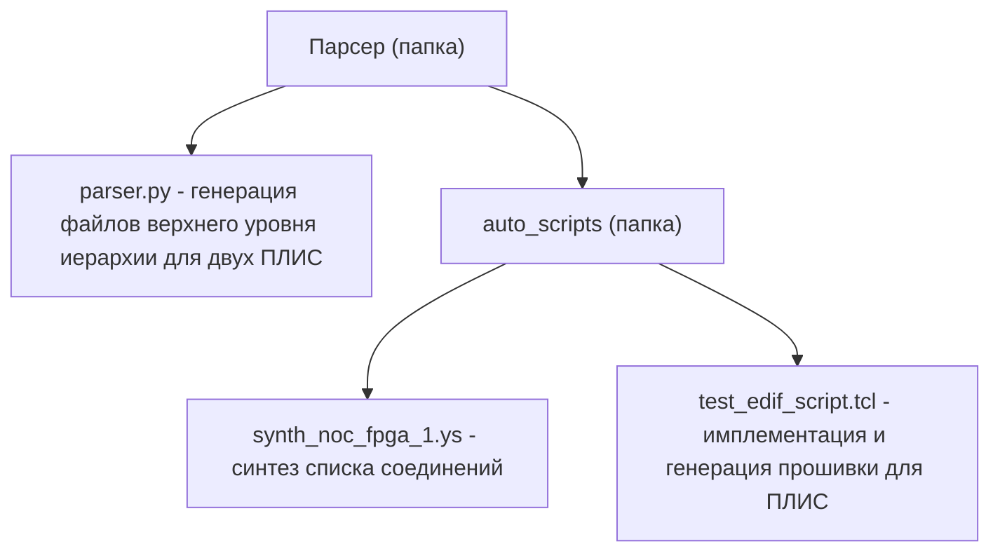
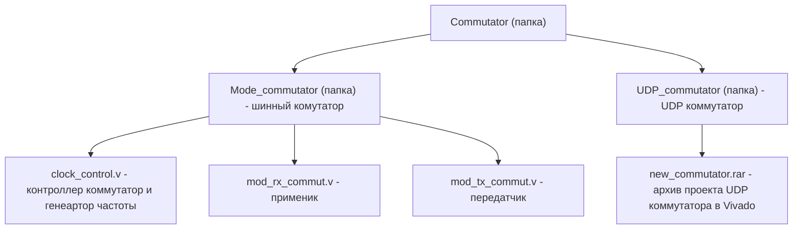

# Проект #629 «Программный комплекс для прототипирования систем на кристалле большого размера с использованием нескольких чипов ПЛИС» 

**Цель проекта:** Программно – аппаратный комплекс, автоматизирующий генерацию прошивок для ПЛИС, и соединяющий обе ПЛИС высокоскоростным интерфейсом.
Задачи:
1)	Разработка программного комплекса для разделения cети на кристалле по нескольким ПЛИС;
2)	Реализация взаимодействия между ПЛИС посредством интерфейса Ethernet;
3)	Имплементация и прототипирование сети на кристалле и реализацию сложной системы на кристалле на двух ПЛИС, соединенных между собой параллельной шиной;

В данной работе использовалась сеть на кристалле, разработанная УЛ САПР. Данная сеть состоит из N узлов (для примера на рисунке их 9), каждый из которых представляет собой роутер и процессор SchoolMIPS. Данная топология называется циркулянтной.

{width=500 height=500}

Программное обеспечение для генерации прошивок (парсер) для двух ПЛИС позволяет упростить разработчику сетей на кристалле и процессоров прототипирование перспективных архитектур на нескольких ПЛИС. Парсер параметризирован, что позволяет с легкостью разъеденить сеть на две ПЛИС: необходимо указать какие роутеры будут имплементированы  в выбранной ПЛИС. Синтез списка соединений основан на открытом инструменте Yosys (https://github.com/YosysHQ/yosys), что упрощает перенос проекта на ПЛИС разных проихводителей (в проекте использовались ПЛИС Xilinx).

Быстродействие системы из нескольких ПЛИС упирается в пропускную способность линий связи кристаллов ПЛИС. Использование GPIO не оправданно по быстродействию, а также недостаточным количеством выводов ПЛИС для больших систем на кристалле (СнК). Решением проблем может быть использование сверхскоростных интерфейсов (например Ethernet). Связь  по Ethernet   реализована благодаря UDP коммутатотору.

### Структура проекта (основной код):

- ***Парсер***

- ***Коммутатор***

